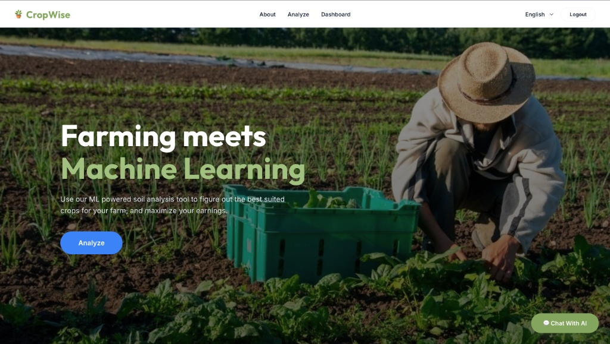
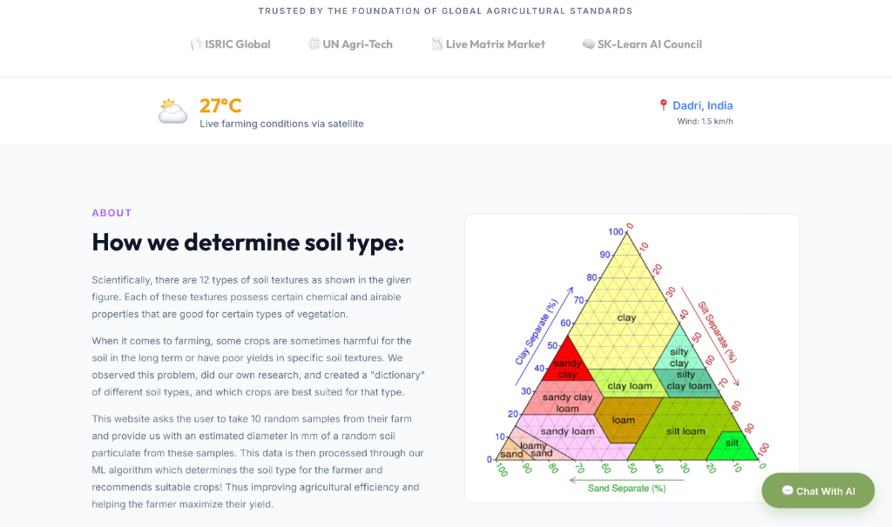
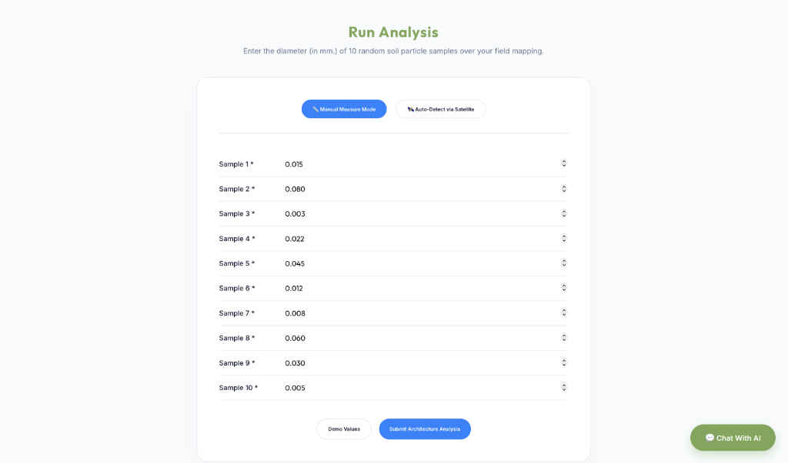
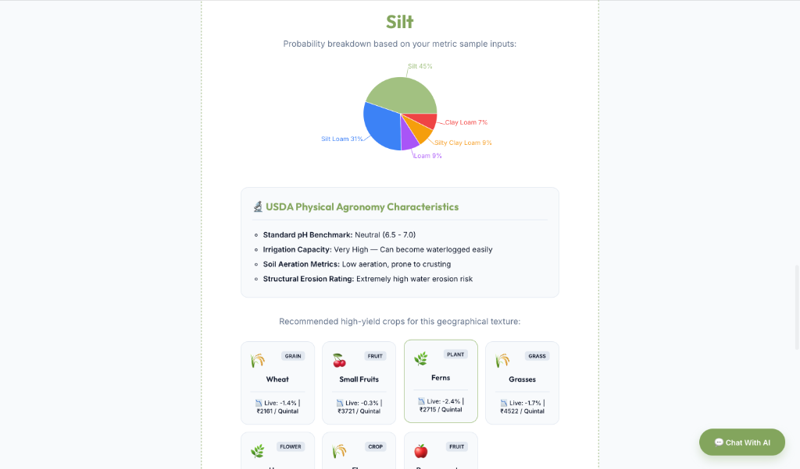
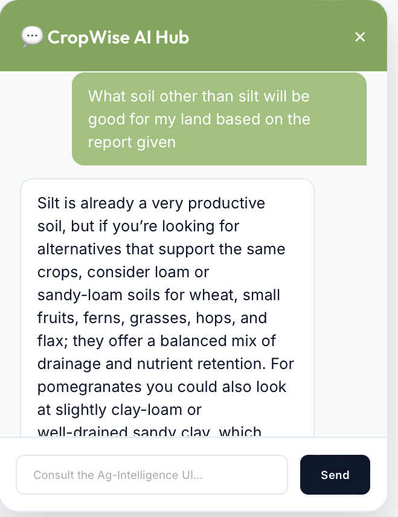

# 🌾 CropWise - AI-Powered Precision Agriculture Assistant

CropWise is a smart farming platform designed to empower farmers with precision agriculture tools. It utilizes an ensemble Machine Learning model (Random Forest Classifier) to classify soil types based on 10 core scientific soil features, recommends optimal crops, displays real-time market mandi prices with realistic fluctuations, and features a friendly AI agricultural consultant for chat assistance.

---

## ✨ Features

- **📊 Soil Classification Engine**: Classifies soil into USDA texture classes (Sand, Loam, Clay, etc.) using a Random Forest Classifier with high test accuracy.
- **🌱 Crop Recommendations & USDA Insights**: Provides customized crop recommendations and detailed physical agronomy profiles (pH, aeration, water retention, erosion risk) for each soil type.
- **📈 Live Commodities Price Engine**: Simulates real-time market mandi rates (₹ per Quintal) with random fluctuations to represent actual agricultural market trends.
- **💬 CropWise AI Consultant**: A built-in virtual agronomist powered by AI to answer agricultural questions, guide farmers on fertilizer applications, and provide crop management advice.
- **🛰️ Satellite Mode**: Pulls real-time soil metadata automatically using coordinates via the ISRIC Global SoilGrids API.

---

## 📸 Screen Previews

### 1. Home Page


### 2. About Page


### 3. Demo Value for Analysis


### 4. Results


### 5. AI ChatBot


---

## 🛠️ Technology Stack

* **Frontend**: React.js (Vite), Recharts, TailwindCSS / Vanilla CSS, HTML5 Canvas & jsPDF (for generating reports).
* **Backend**: Python, Flask, Flask-CORS, SQLAlchemy (SQLite database), PyJWT (for secure handshakes).
* **Machine Learning**: Scikit-Learn (Random Forest Classifier, StandardScaler).

---

## 📁 Project Structure

```text
CropWise/
├── app.py                  # Flask entry point & API routes
├── database.py             # SQLAlchemy models & DB configuration
├── model.py                # Random Forest ML model training & inference
├── locales.js              # Multi-lingual translations
├── main.jsx                # React mount point
├── App.jsx                 # Main application UI (Landing, Dashboard, Results, Chat)
├── index.html              # HTML shell
├── package.json            # Node project configuration
├── vite.config.js          # Vite config
└── .gitignore              # Files ignored in version control
```

---

## 🚀 Quick Start (Local Setup)

### Prerequisites
Make sure you have python 3.x and Node.js installed.

### Run Frontend & Backend Simultaneously
We have configured a combined startup script using `concurrently`. Simply run:

```bash
# 1. Install dependencies
npm install

# 2. Run both frontend and backend
npm run dev-all
```

* Frontend will serve on: `http://localhost:5173`
* Backend will serve on: `http://localhost:5000`

---

## 🧠 Machine Learning Model details

| Property            | Value                         |
|---------------------|-------------------------------|
| **Algorithm**       | Random Forest Classifier (Ensemble) |
| **Estimators**      | 100 Trees                     |
| **Feature Scaling** | StandardScaler (z-score)      |
| **Input Features**  | 10 soil particle properties   |

### 10 Input Features

1. **pH Level**
2. **Nitrogen (N)** (mg/kg)
3. **Phosphorus (P)** (mg/kg)
4. **Potassium (K)** (mg/kg)
5. **Organic Matter** (%)
6. **Moisture Content** (%)
7. **Sand Content** (%)
8. **Silt Content** (%)
9. **Clay Content** (%)
10. **Electrical Conductivity** (dS/m)

---

## 🔌 API Endpoints

### `POST /predict`
Submits 10 soil features to predict the soil class.
```json
// Request
{ "values": [0.015, 0.080, 0.003, 0.022, 0.045, 0.012, 0.008, 0.060, 0.030, 0.005] }

// Response
{
  "soil_type": "Sand",
  "recommended_crops": ["Groundnut", "Watermelon", "Carrots", ...],
  "confidence": 0.48,
  "market_pricing": {
     "Carrots": "📈 Live: +1.0% | ₹2166 / Quintal",
     ...
  },
  "agronomy_details": {
     "ph_level": "Slightly acidic (5.5 - 6.5)",
     "water_retention": "Extremely Low — Drains very rapidly",
     ...
  }
}
```

### `POST /api/chat`
Proxies prompts to the AI agronomy model.
```json
// Request
{ "messages": [{"role": "user", "content": "How do I grow carrots?"}] }
```

---

## 🛡️ License

This project is licensed under the MIT License.
